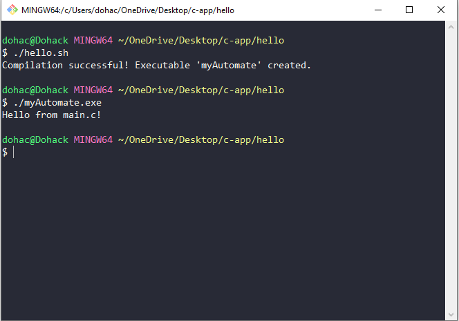

# Bash Scripting Experiments

This repository contains scripts to automate tasks related to C file management and compilation.

## `hello.sh`

A Bash script (`hello.sh`) is included to:

- Create `main.c` with necessary headers and a `main()` function.
- Generate `main.h` with header guards and space for additional declarations.
- Compile `main.c` and `main.h` into an executable named `myAutomate`.

### Usage

1. Clone the repository:
   ```bash
   git clone https://github.com/dohack/Bash-Scripting-Experiments.git
   ```

2. Navigate to the directory:
   ```bash
   cd Bash-Scripting-Experiments
   cd 02-Bash-Scripts-Collection
   cd 005-HelloWorld-in-C
   ```

3. Make the script executable (if needed):
   ```bash
   chmod +x hello.sh
   ```

4. Run the script:
   ```bash
   ./hello.sh
   ```

5. After execution, find the compiled executable `myAutomate` in the directory.

## `clean.sh`

A cleanup script (`clean.sh`) is available to remove unnecessary files:

```bash
#!/bin/bash
rm main.c main.h myAutomate
```

### Usage

Run the cleanup script:
```bash
./clean.sh
```

## Example Output



The `myAutomate` executable, when executed, prints:
```
Hello from main.c!
```

## Rationale

### Advantages

- **Efficiency**: Automates file creation and compilation, speeding up development.
- **Consistency**: Ensures consistent outputs with each script run.

### Challenges

- **Error Handling**: Managing errors during file creation and compilation.
- **Portability**: Ensuring scripts work across different environments.

## License

This project is licensed under the MIT License. See the [LICENSE](LICENSE) file for details.
