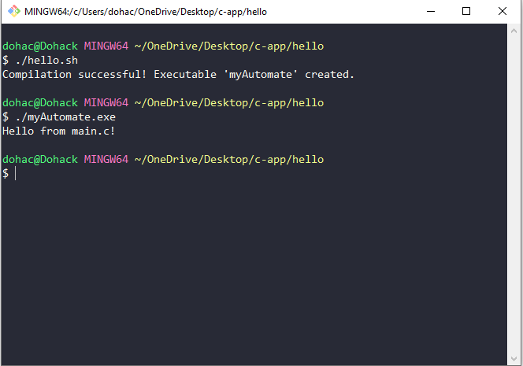

# Simple C file Bash Scripting Experiments

This repository contains a Bash script (`hello.sh`) that automates the creation of C files (`main.c`, `main.h`) and compiles them into an executable (`myAutomate`) that prints "Hello" when executed.

## Script Description

The Bash script `hello.sh` performs the following tasks:

1. **Creates `main.c`:**
   - Includes necessary headers.
   - Defines a `main()` function that prints "Hello from main.c!".

2. **Creates `main.h`:**
   - Defines header guards (`#ifndef`, `#define`, `#endif`).
   - Allows for additional declarations or definitions.

3. **Compiles the Code:**
   - Uses `gcc` to compile `main.c` and `main.h` into an executable named `myAutomate`.

## Usage

To use the script:

1. Clone the repository:
   ```bash
   git clone https://github.com/dohack/Bash-Scripting-Experiments.git
   ```

2. Navigate to the repository directory:
   ```bash
   cd Bash-Scripting-Experiments
   ```

3. Make the script executable (if needed):
   ```bash
   chmod +x hello.sh
   ```

4. Run the script:
   ```bash
   ./hello.sh
   ```

5. After running the script, you will find the compiled executable `myAutomate` in the same directory.

## Example Output



The `myAutomate` executable, when executed, will output:
```
Hello from main.c!
```

## Rationale for Creating `hello.sh`

### Advantages

- **Efficiency**: Automating the creation and compilation process speeds up development and testing cycles.
  
- **Consistency**: Ensures that generated files and compiled binaries are consistent each time the script is run.

- **Learning Tool**: Helps users learn Bash scripting techniques and understand how to integrate scripting with programming languages like C.

### Challenges

- **Error Handling**: Handling errors effectively within the script, such as file creation failures or compilation errors, can be challenging.

- **Portability**: Ensuring the script works across different environments and operating systems without modification can be a challenge, especially if dependencies or system configurations vary.

- **Complexity**: As scripts grow in complexity, maintaining and debugging them can become challenging.

### Features

- **File Generation**: Automatically creates `main.c` and `main.h` with predefined content.

- **Compilation**: Compiles the generated C files into an executable (`myAutomate`).

- **Output**: Provides feedback on the compilation process, indicating whether it was successful and where the executable can be found.

## License

This project is licensed under the MIT License - see the [LICENSE](LICENSE) file for details.